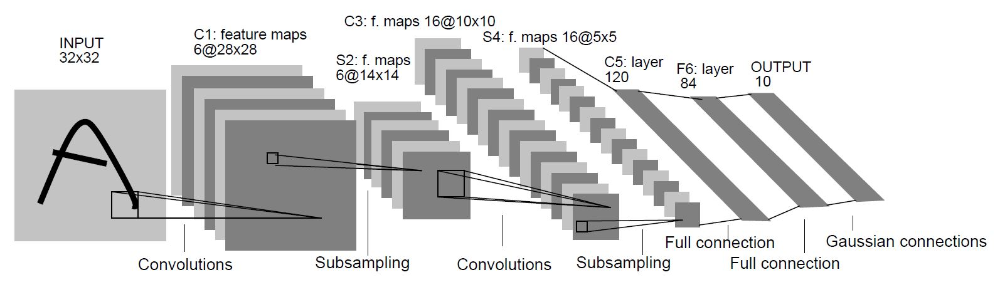

LeNet-5
==========

# __Simple implementation of LeNet-5 by Pytorch__


### - __train__

```
  python3 LeNet.py --mode train --epoch 20 --lr 0.1 --download True --optim SGD --momentum 0.0
```


__mode__ : 'train' or 'test' mode.

__epoch__ : total epoch of train.

__lr__ : learning rate.

__download__ : If True, train and test data are downloaded by torchvision.

__optim__ : optimizer. 'SGD' or 'ADAM'

__momentum__ : momentum parameter in SGD optimizer.


### - __test__

```
  python3 LeNet.py --mode test --download True
```


when I trained this model by 20 epoch, I got __98.56%__ accuracy.
